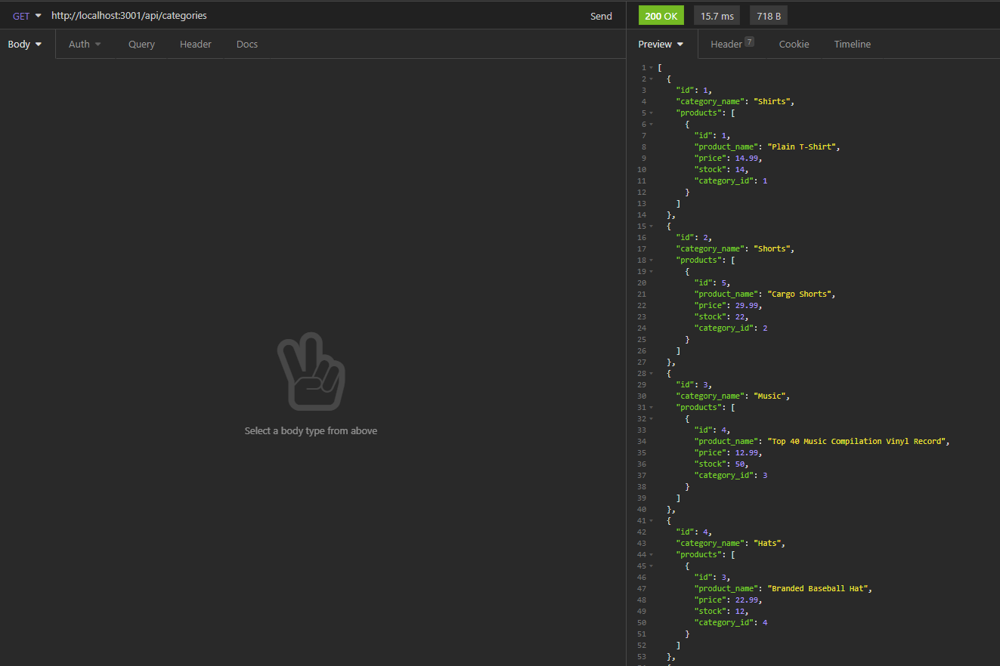

# E Commerce Backend

## Description

Manage your online store with this simple, easy-to-use backend application! Put your merchandise up, categorize them, and give them tags that are appropriate. Additionally, record your prices and stock as you go! ***DISCLAIMER: This application requires you to develop a front end as it is simply just an interactive database.

## Table of Contents
* [Video Walkthrough for Installation and Usage](#video-walkthrough-for-installation-and-usage)
* [Installation](#installation)
* [Usage](#usage)
* [License](#license)
* [Questions](#questions)

## Video Walkthrough for Installation and Usage
https://drive.google.com/file/d/1gy-FCIf-ANwk7GMq-__ibNj9rXdxBt_Y/view?usp=sharing

## Installation
In the root directory in your CLI, run the command 'npm install' to install the dependencies. Then, in your MySQL shell, run the command 'SOURCE db/schema.sql' to initialize your database. Sequelize will handle creating your tables. Optionally, seed some data with the command 'npm run seed'

## Usage
Simply use the command 'npm run start' to start the server. Interact with the server using API clients or a front-end framework.

## License
This project is covered under the MIT license.
[Click here to see the terms of the license](https://choosealicense.com/licenses/mit/)
## Questions
Any questions or concerns?
Contact me on my github: [blazelim](https://github.com/blazelim/)

Or email me at: blazebentleycolim@gmail.com
